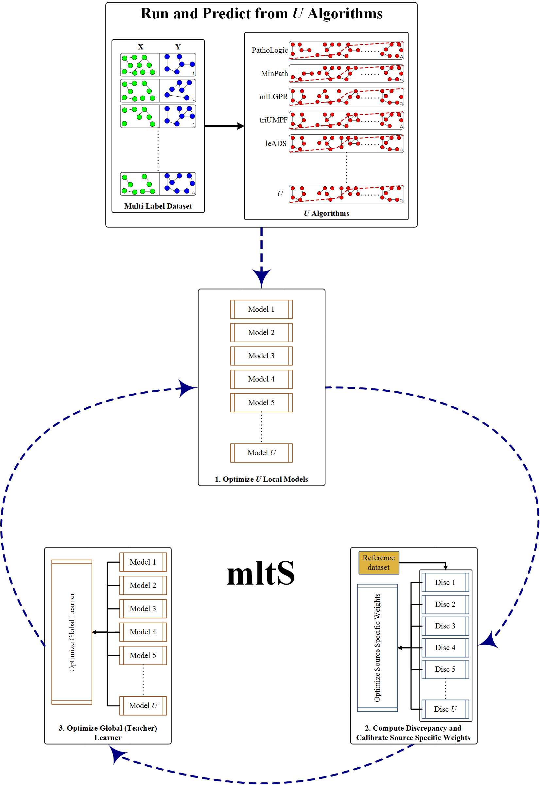

## Basic Description
This repo contains an implementation of mltS (mu**l**ti-label l**e**arning based on less-**t**rusted **S**ources) that leverages the idea of estimating memebers reliability scores in an ensemble given a small reference collection dataset. Specifically, mltS performs an iterative procedure to: (a)- train multiple local learners where each memeber is assigned to learn outputs from an algorithm; (b) build a discrepancy table of learners describing algorithms performances; (c)- estimate the reliability of learners; and (d)- optimize an overall global parameter vectors. Through this approach, mltS is capable to assess the reliability of each model while providing a solution to voting during prediction in an adaptive manner. mltS was evaluated on the pathway prediction task using 10 multi-organism pathway datasets, where the experiments revealed that mltS achieved very compelling and competitive performances against the state-of-the-art pathway inference algorithms.

## Dependencies
The codebase is tested to work under Python 3.7. To install the necessary requirements, run the following commands:

``pip install -r requirements.txt``

Basically, *mltS* requires following packages:
- [Anaconda](https://www.anaconda.com/)
- [NumPy](http://www.numpy.org/) (>= 1.15)
- [scikit-learn](https://scikit-learn.org/stable/) (>= 0.20)
- [pandas](http://pandas.pydata.org/) (>= 0.23)
- [NetworkX](https://networkx.github.io/) (>= 2.2)
- [scipy](https://www.scipy.org/index.html) (==1.2)

## Experimental Objects and Test Samples
Please download the following files from [Zenodo](https://zenodo.org/).
- The link contains the following preprocessed *object* files (store them in one folder):
    - "biocyc.pkl": an object containing the preprocessed MetaCyc database.
    - "pathway2ec.pkl": a matrix representing Pathway-EC association of size (3650, 2526).
    - "pathway2ec_idx.pkl": the pathway2ec association indices.                        
    - "hin.pkl": a sample of heterogeneous information network. 
    - "pathway2vec_embeddings.npz": a sample of embeddings (22593, 128) using RUST-norm. Based on your tests, you need to generate features using [pathway2vec](https://github.com/hallamlab/pathway2vec).
    - "biocyc_features.pkl": related features used for bag based learning. 
- We also provided pretrained models and samples for testing (store data in a folder different than pretrained models to avoid conflicts):
    - "golden_X.pkl": Golden dataset of size (63, 3650). First six examples correspond to: AraCyc, EcoCyc, HumanCyc, LeishCyc, TrypanoCyc, and YeastCyc.
    - "golden_Xe.pkl": Golden dataset of size (63, 3778). First six examples correspond to: AraCyc, EcoCyc, HumanCyc, LeishCyc, TrypanoCyc, and YeastCyc.
    - "golden_y.pkl": Golden dataset of size (63, 2526). First six examples correspond pathways to: AraCyc, EcoCyc, HumanCyc, LeishCyc, TrypanoCyc, and YeastCyc.
    - "symbionts_X.pkl": Symbiont dataset of size (3, 3650).
    - "symbionts_Xe.pkl": Symbiont dataset of size (3, 3778).
    - "symbionts_y.pkl": Symbiont dataset of size (3, 2526).
    - "cami_X.pkl": CAMI dataset of size (40, 3650).
    - "cami_Xe.pkl": CAMI dataset of size (40, 3778).
    - "cami_y.pkl": CAMI dataset of size (40, 2526).
    - "hots_4_X.pkl": HOT metagenomics dataset of size (6, 3650).
    - "hots_4_Xe.pkl": HOT metagenomics dataset of size (6, 3778).
    - "hots_4_y.pkl": HOT metagenomics dataset of size (6, 2526).
    - "biocyc21_X.pkl": BioCyc (v21 tier 2 \& 3) dataset of size (9429, 3650).
    - "biocyc21_Xe.pkl": BioCyc (v21 tier 2 \& 3) dataset of size (9429, 3778).
    - "biocyc21_y.pkl": BioCyc (v21 tier 2 \& 3) dataset of size (9429, 2526).
    - "mltS.pkl": a pretrained model using "biocyc21_Xe.pkl" and "biocyc21_y.pkl". This model was trained using the default settings.
    - "mltS_omega.pkl": a pretrained model using "biocyc21_Xe.pkl" and "biocyc21_y.pkl". This model was trained using the default settings.
    - "mltS_disc.pkl": a pretrained model using "biocyc21_Xe.pkl" and "biocyc21_y.pkl". This model was trained using the default settings.
    - "mltS_confidence.pkl": a pretrained model using "biocyc21_Xe.pkl" and "biocyc21_y.pkl". This model was trained using the default settings.

## Installation and Basic Usage
Run the following commands to clone the repository to an appropriate location:

``git clone https://github.com/hallamlab/mltS.git``

For all experiments, navigate to ``src`` folder then run the commands of your choice. For example, to display *mltS*"s running options use: `python main.py --help`. It should be self-contained.

## Preprocessing
If you have external features (e.g. "pathway2vec_embeddings.npz") with graph file (e.g. "hin.pkl"), then you may wish to execute the following command to preprocess "cami" data (as an example); otherwise, skip this step:

``python main.py --preprocess-dataset --cutting-point 3650 --object-name "biocyc.pkl" --pathway2ec-name "pathway2ec.pkl" --pathway2ec-idx-name "pathway2ec_idx.pkl" --hin-name "hin.pkl" --features-name "pathway2vec_embeddings.npz" --X-name "cami_X.pkl" --file-name "cami" --ospath "[path to the object files (e.g. 'biocyc.pkl')]" --dspath "[path to dataset and to store results]" --batch 50 --num-jobs 2``

where *--cutting-point* is the number of ECs, *--object-name* is an object containing the preprocessed MetaCyc database, *--pathway2ec-name* is a matrix representing Pathway-EC association, *--pathway2ec-idx-name* corresponds the pathway2ec association indices, *--hin-name* is the heterogeneous information network, *--features-name* is features corresponding ECs and pathways, *--file-name* corresponds the name of preprocessed files (wihtout extension), *--batch* is batch size, *--num-jobs* corresponds the number of parallel workers, and *--X-name* is the input space of multi-label data.

## Training

Description about arguments in all examples: *--train-labels* is a boolean variable suggesting to train mltS using only class-labels data (e.g. "biocyc21_Xe.pkl" and "biocyc21_y.pkl"), *--binarize* is a boolean variable indicating whether to binarize data, *--use-external-features* is a boolean variable indicating whether to use external features that are included in data, *--cutting-point* is the cutting point after which binarize operation is halted in the input data, *--calc-ads* is a boolean variable indicating whether to subsample dataset using active dataset subsampling (ADS), *--ads-percent* corresponds the dataset subsampling size (within [0, 1]), *--acquisition-type* is the acquisition function for estimating the predictive uncertainty (["entropy", "mutual", "variation", "psp"]), *--top-k* is the top k labels to be considered for variation ratio or psp acquisition functions, *--ssample-input-size* corresponds the  size of random subsampled inputs, *--ssample-label-size* corresponds the  size of random subsampled pathway labels, *--calc-subsample-size* is the number samples on which the cost function is computed, *--lambdas* corresponds the six hyper-parameters, *--penalty* is the type of the regularization term to be applied, *--batch* is batch size, *--num-jobs* corresponds the number of parallel workers, *--max-inner-iter* corresponds the number of inner iteration for logistic regression, *--num-epochs* corresponds the number of iterations over the training set, *--num-models* corresponds the number of base learners in an ensemble, and *--model-name* corresponds the name of the model excluding any *EXTENSION*. The model name will have *.pkl* extension. The arguments *--X-name* is the input space of multi-label data and *--y-name* is the pathway space of multi-label data. For the dataset, any multi-label dataset can be employed.

**Please** change the names of "mltS.pkl", "mltS_F.pkl", and "mltS_D.pkl" or store them in a different folder to avoid name conflicts during this step.

### Examples for training mltS with labels
#### Example 1
If you wish to train a multi-label dataset (e.g. "biocyc21_Xe.pkl" and "biocyc21_y.pkl") wihtout the subsampling step, execute the following command:

``python main.py --train-labels --binarize --use-external-features --cutting-point 3650 --ssample-input-size 0.7 --ssample-label-size 2000 --calc-subsample-size 1000 --lambdas 0.01 0.01 0.01 0.01 0.01 10 --penalty "l21" --X-name "biocyc21_Xe.pkl" --y-name "biocyc21_y.pkl" --model-name "[model name (without extension)]" --mdpath "[path to store model]" --dspath "[path to the dataset]" --ospath "[path to all object files (e.g. "biocyc.pkl" and "pathway2vec_embeddings.npz")]" --rspath "[path to store costs]" --logpath "[path to the log directory]" --batch 50 --max-inner-iter 5 --num-epochs 10 --num-models 3 --num-jobs 2``

To train on any other multi-abel dataset (e.g. "delicious_train_X.pkl" and "delicious_train_y.pkl"), run the following command as an example:

``python main.py --train-labels --binarize --ssample-input-size 0.7 --ssample-label-size 50 --calc-subsample-size 1000 --lambdas 0.01 0.01 0.01 0.01 0.01 10 --penalty "l21" --X-name "delicious_train_X.pkl" --y-name "delicious_train_y.pkl" --model-name "[model name (without extension)]" --mdpath "[path to store model]" --dspath "[path to the dataset]" --ospath "[path to all object files (e.g. "biocyc.pkl" and "pathway2vec_embeddings.npz")]" --rspath "[path to store costs]" --logpath "[path to the log directory]" --batch 50 --max-inner-iter 5 --num-epochs 10 --num-models 3 --num-jobs 2``

#### Example 2
If you wish to train a multi-label dataset (e.g. "biocyc21_Xe.pkl" and "biocyc21_y.pkl") using the subsampling step with **entropy** as an acquisition function, execute the following command:

``python main.py --train-labels --binarize --use-external-features --cutting-point 3650 --calc-ads --ads-percent 0.7 --acquisition-type "entropy" --ssample-input-size 0.7 --ssample-label-size 2000 --calc-subsample-size 1000 --lambdas 0.01 0.01 0.01 0.01 0.01 10 --penalty "l21" --X-name "biocyc21_Xe.pkl" --y-name "biocyc21_y.pkl" --model-name "[model name (without extension)]" --mdpath "[path to store model]" --dspath "[path to the dataset]" --ospath "[path to all object files (e.g. "biocyc.pkl" and "pathway2vec_embeddings.npz")]" --rspath "[path to store costs and resulted samples indices]" --logpath "[path to the log directory]" --batch 50 --max-inner-iter 5 --num-epochs 10 --num-models 3 --num-jobs 2``

To train on any multi-abel datasets (e.g. "delicious_train_X.pkl" and "delicious_train_y.pkl"), run the following command as an example:

``python main.py --train-labels --binarize --calc-ads --ads-percent 0.7 --acquisition-type "entropy" --ssample-input-size 0.7 --ssample-label-size 50 --calc-subsample-size 1000 --lambdas 0.01 0.01 0.01 0.01 0.01 10 --penalty "l21" --X-name "delicious_train_X.pkl" --y-name "delicious_train_y.pkl" --model-name "[model name (without extension)]" --mdpath "[path to store model]" --dspath "[path to the dataset]" --ospath "[path to all object files (e.g. "biocyc.pkl" and "pathway2vec_embeddings.npz")]" --rspath "[path to store costs and resulted samples indices]" --logpath "[path to the log directory]" --batch 50 --max-inner-iter 5 --num-epochs 10 --num-models 3 --num-jobs 2``

#### Example 3
If you wish to train a multi-label dataset (e.g. "biocyc21_Xe.pkl" and "biocyc21_y.pkl") using the subsampling step with **variation** or **psp** as an acquisition function, you need to provide an additional argument **--top-k** the following command:

``python main.py --train-labels --binarize --use-external-features --cutting-point 3650 --calc-ads --ads-percent 0.7 --acquisition-type "psp" --top-k 50 --ssample-input-size 0.7 --ssample-label-size 2000 --calc-subsample-size 1000 --lambdas 0.01 0.01 0.01 0.01 0.01 10 --penalty "l21" --X-name "biocyc21_Xe.pkl" --y-name "biocyc21_y.pkl" --model-name "[model name (without extension)]" --mdpath "[path to store model]" --dspath "[path to the dataset]" --ospath "[path to all object files (e.g. "biocyc.pkl" and "pathway2vec_embeddings.npz")]" --rspath "[path to store costs and resulted samples indices]" --logpath "[path to the log directory]" --batch 50 --max-inner-iter 5 --num-epochs 10 --num-models 3 --num-jobs 2``

For any multi-abel datasets (e.g. "delicious_train_X.pkl" and "delicious_train_y.pkl"), run the following command as an example:

``python main.py --train-labels --binarize --calc-ads --ads-percent 0.7 --acquisition-type "psp" --top-k 50 --ssample-input-size 0.7 --ssample-label-size 50 --calc-subsample-size 1000 --lambdas 0.01 0.01 0.01 0.01 0.01 10 --penalty "l21" --X-name "delicious_train_X.pkl" --y-name "delicious_train_y.pkl" --model-name "[model name (without extension)]" --mdpath "[path to store model]" --dspath "[path to the dataset]" --ospath "[path to all object files (e.g. "biocyc.pkl" and "pathway2vec_embeddings.npz")]" --rspath "[path to store costs and resulted samples indices]" --logpath "[path to the log directory]" --batch 50 --max-inner-iter 5 --num-epochs 10 --num-models 3 --num-jobs 2``

#### Example 4
To train a multi-label dataset (e.g. "biocyc21_Xe.pkl" and "biocyc21_y.pkl") using predefined samples, you need to provide an additional arguments **---train-selected-sample** and the name of the file in **--samples-ids** (e.g. "mltS_samples.pkl") that is stored in *rspath*:

``python main.py --train-labels ---train-selected-sample --binarize --use-external-features --cutting-point 3650 --ssample-input-size 0.7 --ssample-label-size 2000 --calc-subsample-size 1000 --lambdas 0.01 0.01 0.01 0.01 0.01 10 --penalty "l21" --X-name "biocyc21_Xe.pkl" --y-name "biocyc21_y.pkl" --samples-ids "mltS_samples.pkl" --model-name "[model name (without extension)]" --mdpath "[path to store model]" --dspath "[path to the dataset]" --ospath "[path to all object files (e.g. "biocyc.pkl" and "pathway2vec_embeddings.npz")]" --rspath "[path to store costs and resulted samples indices]" --logpath "[path to the log directory]" --batch 50 --max-inner-iter 5 --num-epochs 10 --num-models 3 --num-jobs 2``

### Examples for training mltS with bags and labels
To train mltS using either *factorization* or *dependency* predictive uncertainty approaches, you need to obtain bags using [reMap](https://github.com/hallamlab/reMap). The same examples in [Markdown - Link](#Link) can be applied here as well. For example to train using *factorization* approach with *variation* based subsampling, run the following command:

``python main.py --train-labels --binarize --use-external-features --cutting-point 3650 --calc-bag-cost --calc-ads --ads-percent 0.7 --acquisition-type "variation" --label-uncertainty-type "factorize" --top-k 50 --ssample-input-size 0.7 --ssample-label-size 2000 --calc-subsample-size 1000 --lambdas 0.01 0.01 0.01 0.01 0.01 10 --penalty "l21" --bags-labels "bag_pathway.pkl" --features-name "biocyc_features.pkl" --centroids "bag_centroid.npz" --X-name "biocyc21_Xe.pkl" --y-name "biocyc21_y.pkl" --yB-name "biocyc21_B.pkl" --model-name "[model name (without extension)]" --mdpath "[path to store model]" --dspath "[path to the dataset]" --ospath "[path to all object files (e.g. "biocyc.pkl" and "pathway2vec_embeddings.npz")]" --rspath "[path to store costs and resulted samples indices]" --logpath "[path to the log directory]" --batch 50 --max-inner-iter 5 --num-epochs 10 --num-models 3 --num-jobs 2 --display-interval 1``

For *dependency* based approach, run the below command:

``python main.py --train-labels --binarize --use-external-features --cutting-point 3650 --calc-bag-cost --calc-ads --ads-percent 0.7 --acquisition-type "variation" --label-uncertainty-type "dependent" --top-k 50 --ssample-input-size 0.7 --ssample-label-size 2000 --calc-subsample-size 1000 --lambdas 0.01 0.01 0.01 0.01 0.01 10 --penalty "l21" --bags-labels "bag_pathway.pkl" --features-name "biocyc_features.pkl" --centroids "bag_centroid.npz" --X-name "biocyc21_Xe.pkl" --y-name "biocyc21_y.pkl" --yB-name "biocyc21_B.pkl" --model-name "[model name (without extension)]" --mdpath "[path to store model]" --dspath "[path to the dataset]" --ospath "[path to all object files (e.g. "biocyc.pkl" and "pathway2vec_embeddings.npz")]" --rspath "[path to store costs and resulted samples indices]" --logpath "[path to the log directory]" --batch 50 --max-inner-iter 5 --num-epochs 10 --num-models 3 --num-jobs 2 --display-interval 1``

where in both commands, *--bags-labels* is the file name to bagging pathways (e.g. "bag_pathway.pkl"), *--features-name* corresponds the file name of the features (e.g. "biocyc_features.pkl"), *--centroids* corresponds the file name of bags centroids (e.g. "bag_centroid.npz"). Note that you need to incoperate class-bags datasets (e.g. "biocyc21_B.pkl").

## Predicting
For inference, we provide few examples. 

Description about arguments in all examples: *--soft-voting* is a boolean variable indicating whether to predict labels based on the calibrated sums of the predicted probabilities from an ensemble, *--pref-rank* is a boolean variable indicating whether to predict labels based on ranking strategy, *--top-k-rank* is of type integer that corresponds the top k labels to be considered for predicting, *--binarize* is a boolean variable indicating whether to binarize data, *--use-external-features* is a boolean variable indicating whether to use external features that are included in data, *--cutting-point* is the cutting point after which binarize operation is halted in the input data, *--decision-threshold* corresponds the cutoff threshold for prediction, *--object-name* is an object containing the preprocessed MetaCyc database, *--pathway2ec-name* is a matrix representing Pathway-EC association, *--pathway2ec-idx-name* corresponds the pathway2ec association indices, *--hin-name* is the heterogeneous information network, *--features-name* is features corresponding ECs and pathways, *--file-name* corresponds the name of several preprocessed files (without extension), *--batch* is batch size, *--num-jobs* corresponds the number of parallel workers, and *--model-name* corresponds the name of the model excluding any *EXTENSION*. The model name will have *.pkl* extension. The arguments *--X-name* is the input space of multi-label data. For the dataset, any multi-label dataset can be employed.

### Examples for predicting labels
#### Example 1
To predict outputs from a dataset using already trained model ("mltS.pkl") with **soft-voting** prediction strategy, execute the following basic command:

``python main.py --predict --pred-labels --soft-voting --binarize --use-external-features --cutting-point 3650 --decision-threshold 0.5 --X-name "cami_Xe.pkl" --file-name "mltS" --model-name "mltS" --dspath "[path to the dataset and to store predicted results]" --mdpath "[path to the pretrained model "mltS.pkl"]" --batch 50 --num-jobs 2``

To predict using any multi-abel datasets (e.g. "delicious_test_X.pkl") with **soft-voting** prediction strategy, run the following command as an example:

``python main.py --predict --pred-labels --soft-voting --binarize --decision-threshold 0.5 --X-name "delicious_test_X.pkl" --file-name "mltS" --model-name "[model name (without extension)]" --dspath "[path to the dataset and to store predicted results]" --mdpath "[path to the pretrained model "mltS.pkl"]" --batch 50 --num-jobs 2``

#### Example 2
To predict outputs from a dataset using already trained model ("mltS.pkl") with **pref-rank** prediction strategy, execute the following basic command:

``python main.py --predict --pred-labels --pref-rank --binarize --use-external-features --cutting-point 3650 --top-k-rank 100 --X-name "cami_Xe.pkl" --file-name "mltS" --model-name "mltS" --dspath "[path to the dataset and to store predicted results]" --mdpath "[path to the pretrained model "mltS.pkl"]" --batch 50 --num-jobs 2``

To predict using any multi-abel datasets (e.g. "delicious_test_X.pkl") with **pref-rank** prediction strategy, run the following command as an example:

``python main.py --predict --pred-labels --pref-rank --binarize --top-k-rank 100 --X-name "delicious_test_X.pkl" --file-name "mltS" --model-name "[model name (without extension)]" --dspath "[path to the dataset and to store predicted results]" --mdpath "[path to the pretrained model "mltS.pkl"]" --batch 50 --num-jobs 2``

#### Example 3
To predict outputs and **compile pathway report** from a dataset (e.g. "symbionts_Xe.pkl"), generated by MetaPathways v2, using an already trained model ("mltS.pkl"), execute the following command:

``python main.py --predict --pred-labels --pathway-report --parse-pf --build-features --soft-voting --binarize --use-external-features --cutting-point 3650 --decision-threshold 0.5 --object-name "biocyc.pkl" --pathway2ec-idx-name "pathway2ec_idx.pkl" --pathway2ec-name "pathway2ec.pkl" --hin-name "hin.pkl" --features-name "pathway2vec_embeddings.npz" --X-name "symbionts_X.pkl" --file-name "mltS" --model-name "mltS" --dsfolder "[name of the Pathologic MetaPathways generated main directory]" --rsfolder "[name of the the results folder]" --ospath "[path to the object files (e.g. 'biocyc.pkl')]" --dspath "[path to the dataset and to store predicted results]" --mdpath "[path to the pretrained model "mltS.pkl"]" --rspath "[path to storing results]" --batch 50 --num-jobs 2``

where *--pathway-report* enables to generate a detailed report for pathways for each instance, *--parse* is a boolean variable implying to whether parse Pathologic format file (pf) from a given folder, and *--build-features* indicates whether to construct features for each example. **Note:** this argument is only implemented for the pathway predictions.
                                   
### Examples for predicting labels
To predict bags from a dataset using already trained model ("mltS.pkl") with **soft-voting** prediction strategy, enable **pred-bags** option:

``python main.py --predict --pred-bags --soft-voting --binarize --use-external-features --cutting-point 3650 --decision-threshold 0.5 --X-name "cami_Xe.pkl" --file-name "mltS" --model-name "mltS" --dspath "[path to the dataset and to store predicted results]" --mdpath "[path to the pretrained model "mltS.pkl"]" --batch 50 --num-jobs 2``

For **pref-rank** prediction strategy, run the following:

``python main.py --predict --pred-bags --pref-rank --binarize --use-external-features --cutting-point 3650 --top-k-rank 100 --X-name "cami_Xe.pkl" --file-name "mltS" --model-name "mltS" --dspath "[path to the dataset and to store predicted results]" --mdpath "[path to the pretrained model "mltS.pkl"]" --batch 50 --num-jobs 2``

## Citing
If you find *mltS* useful in your research, please consider citing the following paper:
- [TO BE ADDED].

## Contact
For any inquiries, please contact: [arbasher@alumni.ubc.ca](mailto:arbasher@alumni.ubc.ca)
